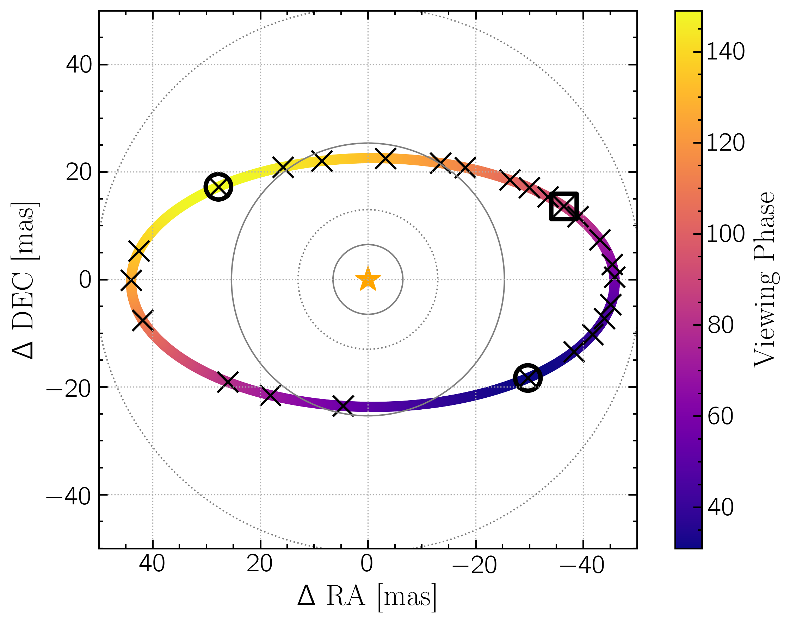
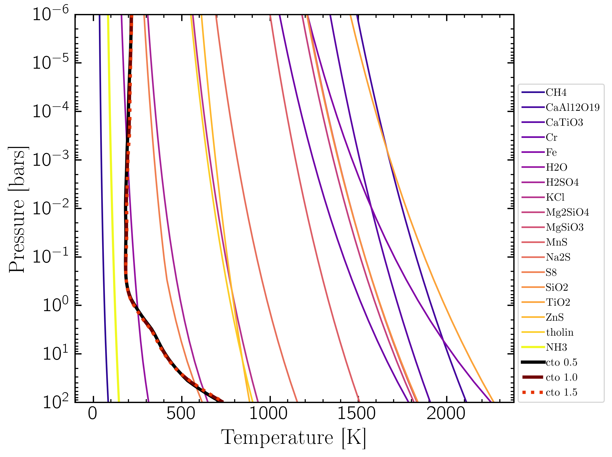

Modeling GJ 876 b & c with ReflectX and Picaso/Virga
==========================================================

Can we distinguish GJ 876 b and c atmosphere cases with ELTs like GMT/GMagAO-X?

Known system parameters:

.. list-table::
   :header-rows: 1
   
   * - Param
     - Value
     - Ref
   * - GJ 876 b:
     -
     -
   * - semi-major axis
     - 0.2177 +0.0018/-0.0019 au
     - Rosenthal et al. 2021
   * - period
     - 61.03474 +0.00080/-0.00084 d
     - Rosenthal et al. 2021
   * - eccentricity
     - 0.0020 +0.0019/-0.0014
     - Rosenthal et al. 2021
   * - inclination
     - 59 deg
     - Trifonov et al. 2018
   * - Mp
     - 2.2756 +/- 0.0045 Mjup
     - Rivera et al. 2010
   * - GJ 876 c:
     -
     -
   * - GJ 876:
     -
     -
   * - Star Teff
     - 3300 K
     - Rosenthal et al. 2021
   * - Star radius
     - 0.37 Rsun
     - Rosenthal et al. 2021
   * - Star SpT
     - M2.5V
     - Turnbull 2015
   * - Star log(Luminosity)
     - -1.914 +/-0.007
     - von Braun et al. 2014
   * - log(g)
     - 4.9 cm s^-2
     - Rosenthal et al. 2021
   * - metallicity
     - 0.21 dex
     - Rosenthal et al. 2021
    

GJ 876 b
---------

`Download the models <https://zenodo.org/records/10594918>`_
~~~~~~~~~~~~~~~~~~~~~~~~~~~~~~~~~~~~~~~~~~~~~~~~~~~~~~~~~~~~~

GJ 876 b is a 2 Mjup planet with a well-constrained inclination, and thus well known mass, and orbital parameters.  So we can use Picaso's PT solver and Virga to make gas giant models for phases along the known orbit.

We sampled the viewing phase parameter space in 5 degree phase angles.  This figure shows the phase sample points along the orbit as viewed in the plane of the sky.  The locations of min and max phases are marked with thick black circles, and the location of quadrature (phase = 90 deg) is marked with a thick black square.  The solid grey circles mark the size of 1 :math:`\lambda`/D for MagAO-X (diameter = 6.5m; larger circle) and for GMagAO-X (diameter = 25.4m; smaller circle) at 800 nm.  The dotted grey lines mark the size of :math:`2 \times \lambda`/D for each.

We produced models for each of the above phases using `Picaso <https://natashabatalha.github.io/picaso/>`_ to model the atmosphere and `Virga <https://natashabatalha.github.io/virga/>`_ to model the cloud properties.

We produced models for three values of C/O ratio, which impacts molecular mixing ratios (see `Madhusudhan 2012 <https://ui.adsabs.harvard.edu/abs/2012ApJ...758...36M/abstract>`_).  This plot shows the pressure-temperature profile for models of the three C/O ratios, plotted over condensation curves for a variety of molecules.  If the condensation curve crosses below the PT profile, the molecule can condense to form clouds.  Our models of GJ 876 b contain water and S8 (haze) clouds. We see that the value of C/O has little effect on the PT profile in our models.

For cloud models we parameterized cloud properties by varying the sedimentation efficiency :math:`f_sed` and the strength of mixing :math:`k_zz`.  We used:

* Five values of f_sed -- 0.03, 0.3, 1, 6, 10 -- which describes the cloud sedimentation efficiency.  A small f_sed produces thick vertically extended clouds with small particles; a large value of f_sed produces thin clouds with large particles. See `Gao et al 2018 <https://ui.adsabs.harvard.edu/abs/2018ApJ...855...86G/abstract>`_

* Two values of K_zz -- 1x10^9 and 1x10^11 -- which describes the strength of vertical mixing.  Larger value = more vigorous mixing. See `Mukherjee et al. 2022 <https://ui.adsabs.harvard.edu/abs/2022ApJ...938..107M/abstract>`_

To analyze our model results we used filter passbands similar to current and future MagAO-X filters and to what is anticipated to be used in GMagAO-X: SDSS g', r', i', z' and MKO J and H bands.

Colors at a given phase
^^^^^^^^^^^^^^^^^^^^^^^

The figure below shows the planet/star contrast ('fpfs') at the central wavelength of each filter for the model at quadrature for each of the cloudy and cloud-free cases.  The filter passbands are shown at the bottom in grey.  We see that for high values of kzz + large fsed the clouds aren't appreciably different from the cloud-free case.  The kzz value has significant impact on the contrast for higher values of fsed, while for fsed=0.03 it makes little difference. For the smallest fsed the contrast is early constant, while for thinner clouds (higher fsed) the model is much fainter at redder wavelengths.

.. image:: images/GJ876b-phase90.0-cto1.0-contrast-per-filter.png
   :width: 100 %

Putting these models on a color-magnitude diagram, we see that many of the cloudy models are well separated by several magnitudes on J vs H-i space.  The error bars represent three different signal-to-noise ratios.  For S/N = 20 the errorbars are smaller than the markers.  At the largest phase for this system (30 deg, sep = 35 mas, 1.4 :math:`\lambda`/D for MagAO-X at 800 nm, 5.4 :math:`\lambda`/D for GMagAO-X at 800 nm ) the models are ~1 magnitude brighter in J.

.. image:: images/GJ876b-phase90.0-cto1.0-contrast-vs-clouds-CMD.png
   :width: 100 %

Phase curves
^^^^^^^^^^^^

The plots below show contrast as a function of phase in two filters (plots for all filters can be found `here <https://zenodo.org/records/10594918>`_).  We see that the behavior as a function of phase changes in different filter bands.

.. image:: images/GJ876b-phase-curve-r-cto1.0.png
   :width: 100 %

.. image:: images/GJ876b-phase-curve-J-cto1.0.png
   :width: 100 %

Putting these on a CMD for three different phases spanning the parameter space:

.. image:: images/GJ876b-cto1.0-contrast-vs-clouds-CMD-3phases.png
   :width: 100 %

GJ 876 c
---------
In progress