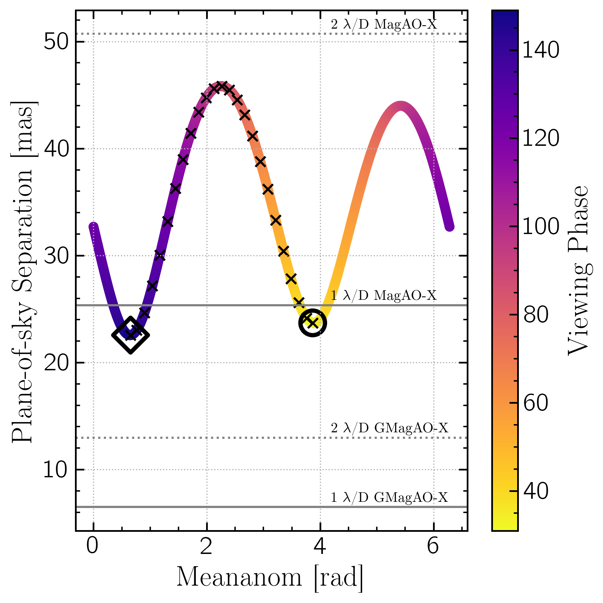
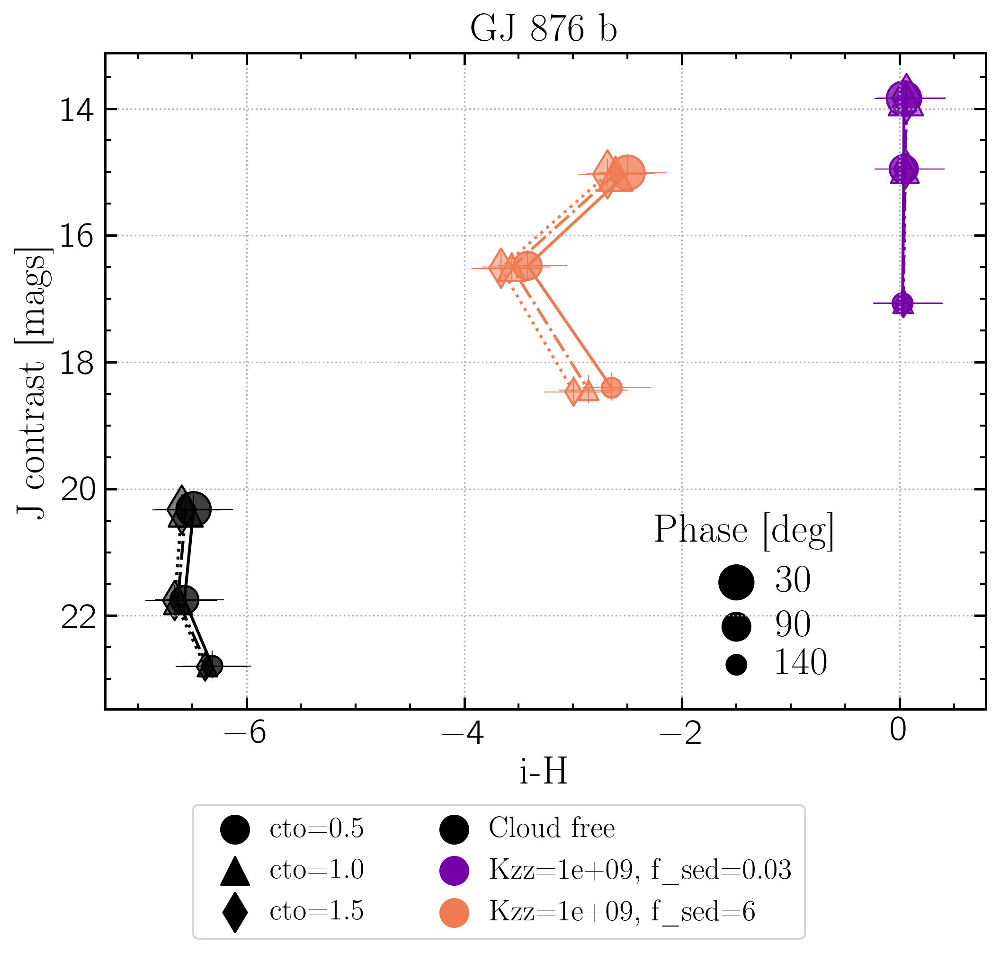
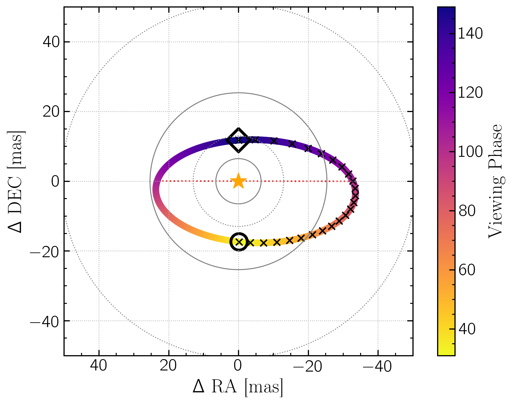
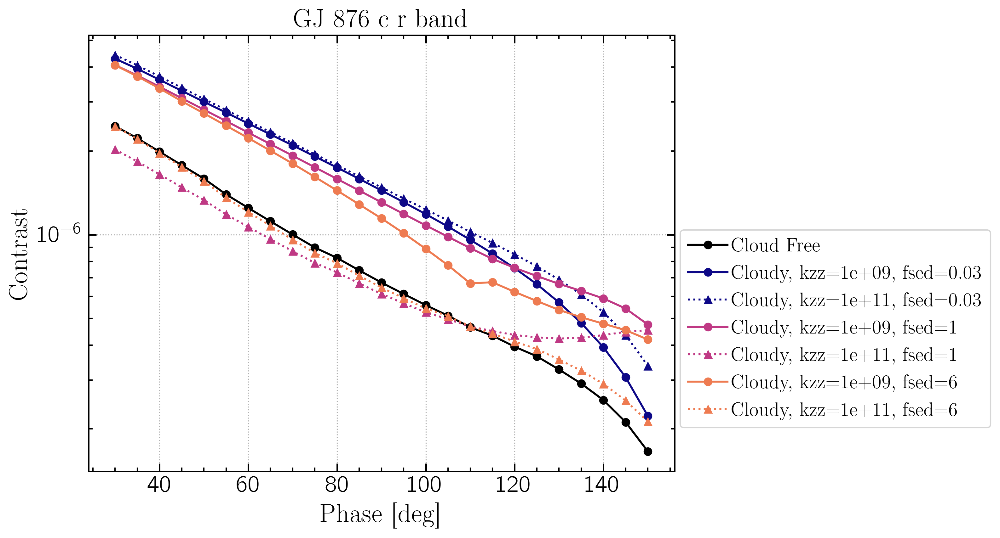
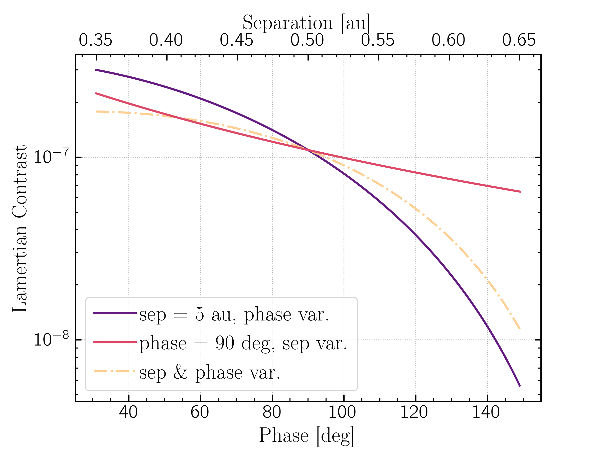

Modeling GJ 876 b & c with ReflectX and Picaso/Virga
==========================================================

Can we distinguish GJ 876 b and c atmosphere cases with ELTs like GMT/GMagAO-X?

GJ 876 is a four-planet system (b: Marcy et al. 1998, c: Marcy et al 2001, d: Rivera et al. 2005, e: Rivera et al. 2010), all of which have been detected through detailed RV.  GJ 876's proximity to Earth (4.7 pc, Gaia DR3) and the large mass/radius and separation of GJ 876 b and c make this an ideal system to be one of the first targets for reflected light exoplanet detection.

`This plot <http://www.loganpearcescience.com/research/TargetList-GMagAOX-Max-separation-contrast-gj876-proxcen.html>`_ shows ~400 of the nearest known RV detected exoplanets with separation in :math:`\lambda`/D for 800nm and a GMT-sized primary on the x-axis and planet/star contrast for a Lambertian sphere with geo albedo = 0.3.  GJ 876 b and c and Prox Cen b are marked with red outlines.  GJ 876 b and c are the lowest-hanging fruit for reflected light observations.  (For more on how this plot is made see `<http://www.loganpearcescience.com/reflected-light-calculations.html>`_)

Rivera et al. 2010 showed that a coplanar model for all four planets with incl ~ 59 deg gives a 3-body resonance between planets b, c, and e, with e being in a 2:1 mean-motion resonance (MMR) with c and a 4:1 MMR with b, and a Laplace resonance with both b and c, and that this dynamical structure enables long-term survival of the system.  The mutual inclination between b and c aren't constrained.  Enforcing coplanarity on orbit fits for all four planets, they find that a high eccentricity for c and d (0.25591 +/- 0.00093 and 0.207 +/- 0.055 respectively) and a nearly circular orbit for b and e (0.0324 +/- 0.0013 and 0.055 +/- 0.012 respectively) well fit the data and were stable out to at least 1 Gyr.  However, Rosenthal et al. 2021 do not enforce coplanarity and do not determine an inclination; they derive an eccentricty of 0.0069 +0.0063/-0.0050 from their fit to 24 years of CLS RV data, a significant difference from the eccentric orbit.  **GMagAO-X will be essential for constraining the orbit of this planet.**

Known system parameters for the planets of interest, b and c:

.. list-table::
   :header-rows: 1
   
   * - Param
     - Value
     - Ref
   * - **GJ 876 b:**
     -
     -
   * - semi-major axis
     - 0.2177 +0.0018/-0.0019 au
     - Rosenthal et al. 2021
   * - period
     - 61.03474 +0.00080/-0.00084 d
     - Rosenthal et al. 2021
   * - eccentricity
     - 0.0020 +0.0019/-0.0014
     - Rosenthal et al. 2021
   * - inclination
     - 59 deg
     - Trifonov et al. 2018
   * - Mp
     - 2.2756 +/- 0.0045 Mjup
     - Rivera et al. 2010
   * - **GJ 876 c:**
     -
     -
   * - semi-major axis
     - 0.1363 +0.0011/-0.0012 au
     - Rosenthal et al. 2021
   * - period
     - 30.22902 +0.00052/-0.00055 d
     - Rosenthal et al. 2021
   * - eccentricity
     - 0.25591 +/- 0.00093*
     - Rivera et al. 2010
   * - inclination
     - 59 deg*
     - Rivera et al. 2010
   * - Mp
     - 0.7142 +/- 0.0039 Mjup*
     - Rivera et al. 2010
   * - **GJ 876:**
     -
     -
   * - Star Teff
     - 3300 K
     - Rosenthal et al. 2021
   * - Star radius
     - 0.37 Rsun
     - Rosenthal et al. 2021
   * - Star SpT
     - M2.5V
     - Turnbull 2015
   * - Star log(Luminosity)
     - -1.914 +/-0.007
     - von Braun et al. 2014
   * - log(g)
     - 4.9 cm s^-2
     - Rosenthal et al. 2021
   * - metallicity
     - 0.21 dex
     - Rosenthal et al. 2021

:sup:`*` Rivera et al. 2010 and other references enforce co-planarity with GJ 876 b to derive properties for GJ 876 c.  
    

GJ 876 b
---------

`Download the models <https://zenodo.org/records/10594918>`_
~~~~~~~~~~~~~~~~~~~~~~~~~~~~~~~~~~~~~~~~~~~~~~~~~~~~~~~~~~~~~

GJ 876 b is a 2 Mjup planet with a well-constrained inclination, and thus well known mass, and orbital parameters.  So we can use Picaso's PT solver and Virga to make gas giant models for phases along the known orbit.

We sampled the viewing phase parameter space in 5 degree phase angles.  This figure shows the phase sample points along the orbit as viewed in the plane of the sky.  The locations of min and max phases are marked with thick black circles, and the location of quadrature (phase = 90 deg) is marked with a thick black square.  The solid grey circles mark the size of 1 :math:`\lambda`/D for MagAO-X (diameter = 6.5m; larger circle) and for GMagAO-X (diameter = 25.4m; smaller circle) at 800 nm.  The dotted grey lines mark the size of :math:`2 \times \lambda`/D for each.  The bottom figure shows the same in separation as a function of time (parameterized as orbital mean anomaly).

We produced models for each of the above phases using `Picaso <https://natashabatalha.github.io/picaso/>`_ to model the atmosphere and `Virga <https://natashabatalha.github.io/virga/>`_ to model the cloud properties.

We produced models for three values of C/O ratio, which impacts molecular mixing ratios (see `Madhusudhan 2012 <https://ui.adsabs.harvard.edu/abs/2012ApJ...758...36M/abstract>`_).  This plot shows the pressure-temperature profile for models of the three C/O ratios, plotted over condensation curves for a variety of molecules.  If the condensation curve crosses below the PT profile, the molecule can condense to form clouds.  Our models of GJ 876 b contain water and S8 (haze) clouds. We see that the value of C/O has little effect on the PT profile in our models.

For cloud models we parameterized cloud properties by varying the sedimentation efficiency :math:`f_sed` and the strength of mixing :math:`k_zz`.  We used:

* Five values of f_sed -- 0.03, 0.3, 1, 6, 10 -- which describes the cloud sedimentation efficiency.  A small f_sed produces thick vertically extended clouds with small particles; a large value of f_sed produces thin clouds with large particles. See `Gao et al 2018 <https://ui.adsabs.harvard.edu/abs/2018ApJ...855...86G/abstract>`_

* Two values of K_zz -- 1x10^9 and 1x10^11 -- which describes the strength of vertical mixing.  Larger value = more vigorous mixing. See `Mukherjee et al. 2022 <https://ui.adsabs.harvard.edu/abs/2022ApJ...938..107M/abstract>`_

To analyze our model results we used filter passbands similar to current and future MagAO-X filters and to what is anticipated to be used in GMagAO-X: SDSS g', r', i', z' and MKO J and H bands.

Results
~~~~~~~

Colors at a given phase
^^^^^^^^^^^^^^^^^^^^^^^

The figure below shows the planet/star contrast ('fpfs') at the central wavelength of each filter for the model at quadrature for each of the cloudy and cloud-free cases.  The filter passbands are shown at the bottom in grey.  We see that for high values of kzz + large fsed the clouds aren't appreciably different from the cloud-free case.  The kzz value has significant impact on the contrast for higher values of fsed, while for fsed=0.03 it makes little difference. For the smallest fsed the contrast is early constant, while for thinner clouds (higher fsed) the model is much fainter at redder wavelengths.

.. image:: images/GJ876b-phase90.0-cto1.0-contrast-per-filter.png
   :width: 100 %

Putting these models on a color-magnitude diagram, we see that many of the cloudy models are well separated by several magnitudes on J vs H-i space.  The error bars represent three different signal-to-noise ratios.  For S/N = 20 the errorbars are smaller than the markers.  At the largest phase for this system (30 deg, sep = 35 mas, 1.4 :math:`\lambda`/D for MagAO-X at 800 nm, 5.4 :math:`\lambda`/D for GMagAO-X at 800 nm ) the models are ~1 magnitude brighter in J.

Phase curves
^^^^^^^^^^^^

The plots below show contrast as a function of phase in two filters (plots for all filters can be found `here <https://zenodo.org/records/10594918>`_).  We see that the behavior as a function of phase changes in different filter bands.

.. image:: images/GJ876b-phase-curve-r-cto1.0.png
   :width: 100 %

Putting these on a CMD for three different phases spanning the parameter space:

Broadband photometry does not have constraining power for C/O ratio.  The plot below shows three model sets -- cloud free, tall thick clouds, and small thin clouds -- in J vs H-i color for three values of C/O ratio, 0.5, 1.0, and 1.5.  Points in CMD space aren't separated beyond error bars for S/N = 5.

GJ 876 c
---------

As discussed above, GJ 876 c does not have a well-constrained orbit.  Most references in the Exoplanet Archive enforce co-planarity with GJ 876 b to derive properties for GJ 876 c, resulting in a co-planar but highly eccentric (e=0.26) orbit.  

We modeled both orbit options for this planet.  First we adopted the co-planarity assumption with higher eccentricity and mass estimate. We also produced circular orbits assuming coplanarity (inc = 60) and for inc = 10, 45, and 80 deg.  

The eccentric orbit
~~~~~~~~~~~~~~~~~~~
For these models we adopted the inclination, eccentricity, and mass in the above table.  Given the high eccentricity, the planet-star separation varies significantly enough to potentially affect the atmophere model.

We sampled the viewing phase parameter space in 5 degree phase angles.  This figure shows the phase sample points along the orbit as viewed in the plane of the sky.  The locations of min and max phases are marked with thick black circles; the red dashed line marks the line of nodes, with phase>90 being towards the observer and phase<90 being away from the observer.  The solid grey circles mark the size of 1 :math:`\lambda`/D for MagAO-X (diameter = 6.5m; larger circle) and for GMagAO-X (diameter = 25.4m; smaller circle) at 800 nm.  The dotted grey lines mark the size of :math:`2 \times \lambda`/D for each.  The middle figure shows the same in separation as a function of time (parameterized as orbital mean anomaly).  The bottom figure shows the phase and separation sampling as a function of planet-star separation.

.. image:: images/GJ876c-Model-phase-sampling-PhysicalSepvsTime.png
   :width: 100 %

Results
~~~~~~~

This figure shows GJ 876 c models for C/O = 1.0 in J and H-i space for three phases for 7 cloud conditions.  We see that for some cases the planet actually gets brighter at higher phases.

This is also seen in phase curves.

In z band we see the kzz=1e11/fsed=1 cloud model getting brighter at higher phases, even brighter than at full phase.  The kzz=1e9/fsed=6 case also shows a sharp bend at phase=110 deg.

As described above, the eccentric orbit coupled with the relatively close semi-major axis means the separation wrt the star changes significantly throughout the orbit.  This figure shows the phase along the orbit as viewed in the orbit plane, with the separation at four phases marked in orange.

We see that the closest points of the orbit correspond to larger viewing phase angles for the observer, so there is a trade off in reflected light flux between decreasing flux due to phase and increasing contrast with closer separation (contrast :math:`\propto 1/r^2`) and hotter atm/clouds.

In the figure below we show the contrast for a Lambertian sphere (uniform albedo spaitially and spectrally) with albedo = 0.3 for a planet/star of the same mass/radius as GJ 876 c, with semi-major axis = 0.5 au and eccentricity = 0.3.  We computed contrast using Eqn 1 in Cahoy et al. 2010:

.. math::

   C =  A_{g} \left(\frac{R_{p}}{r} \right)^{2} \; [\sin{\alpha} + (\pi - \alpha) \cos{\alpha}]\frac{1}{\pi}

where :math:`A_{g}` is the geometric albedo, :math:`R_{p}` is the planet radius, :math:`r` is the separation in the orbit plane, and :math:`\alpha` is the phase.  

The phase term is of order :math:`10^{0}` while the :math:`\left(\frac{R_{p}}{r} \right)^{2}` term is of order :math:`10^{6}`, so even though contrast goes as :math:`\left(\frac{1}{r} \right)^{2}`, the phase term has a greater effect on the contrast. In this figure we show the contrast as a function of phase for a constant separation (r = 0.5 au; blue line), contrast as a function of separation for a constant phase (phase = 90 deg; red line), and contrast as a function of phase and separation if minimum separation corresponded to maximum (faintest) phase as we have for GJ 876 c (yellow dashed line).  We see that the phase has a much larger effect on contrast than the 1/r squared relation in the ranges we are interested in.  

However the higher stellar flux at closer separations does impact the model climate solution and cloud behavior. In the plot below we show the pressure-temperature profile for models with C/O = 1.0 and at phases 60, 120, and 140 deg. The higher phase angles are closer to the star; 140 deg is at ~0.10 au, 120 deg at ~0.15 au, and 60 deg is at ~0.17 au.  The PT profiles are plotted over the condensation curves for various molecular species.  The inset shows the region wherre the PT profiles cross the curves of interest. We see that the hotter, more crescent phases cross the S8 (sulfer haze) curve at higher altitudes enabling taller, thicker haze clouds, and that hotter models don't cross the water curve at all.

