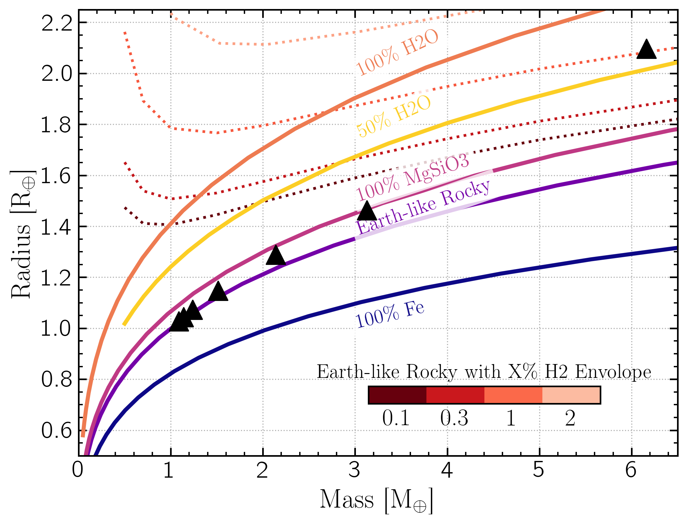
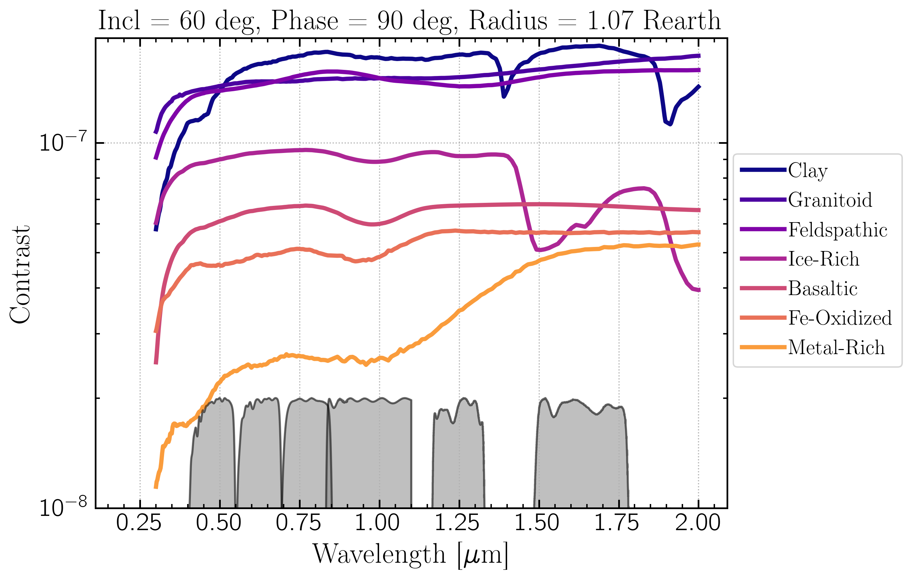
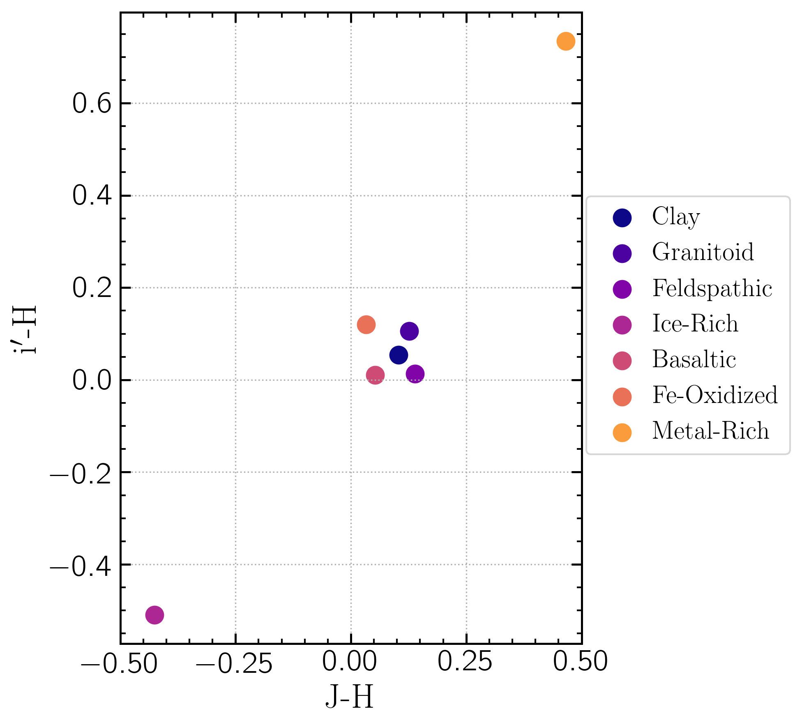
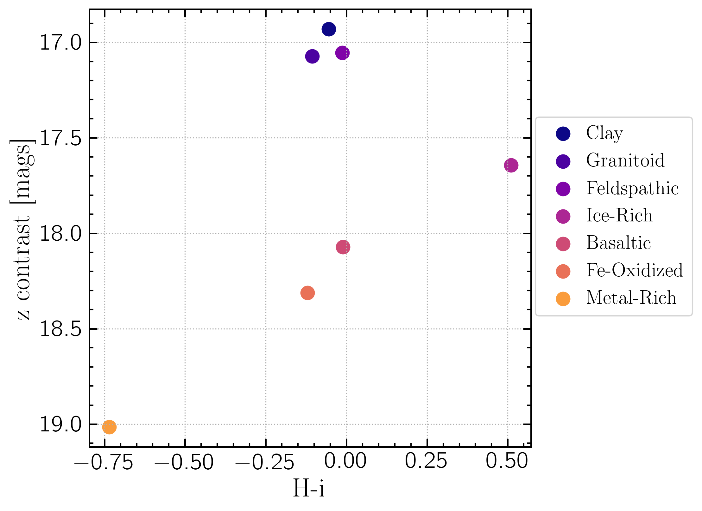

Modeling Proxima Centauri b with ReflectX and Picaso/Virga
==========================================================

Can we distinguish Proxima Centauri b atmosphere cases with ELTs like GMT/GMagAO-X?

Known Prox Cen/ Prox Cen b parameters:

.. list-table::
   :header-rows: 1
   
   * - Param
     - Value
     - Ref
   * - semi-major axis
     - 0.048 au
     - Faria et al. 2022
   * - period
     - 11.19 d
     - Faria et al. 2022
   * - eccentricity
     - 0.02
     - Faria et al. 2022
   * - Mp*sin(incl)
     - 1.07 Mearth
     - Faria et al. 2022
   * - equil. temp.
     - 230 K
     - Anglada-Escude et al. 2016
   * - Star Teff
     - 3000 K
     - Approx value from several refs
   * - Star radius
     - 0.14 Rsun
     - Faria et al. 2022
   * - Star SpT
     - M5.5V
     - Faria et al. 2022
   * - Star log(Luminosity)
     - -2.8 +0.1/-0.2
     - Faria et al. 2022
   * - log(g)
     - 5.2 cm s^-2
     - Faria et al. 2022
   * - metallicity
     - 0.21 dex
     - Schlaufman and Laughlin 2012
    

No Atmosphere Models
-------------------

The first case is an airless rocky planet.  In this case, we will simply observe the star's spectrum reflecting from the surface, with a planet-star contrast determined by the albedo of the planet's surface composition. We used Eqn 1 from Cahoy et al. 2010 for the contrast of a given Lambertian sphere with albedo :math:`A_g` , radius :math:`R_p` , separation :math:`\rho` , and phase angle :math:`\alpha` 

.. math::

   C(\alpha) = A_g(\lambda) \left( \frac{R_p}{\rho} \right)^2 \left[ \frac{\sin(\alpha) + (\pi - \alpha)\cos(\alpha)}{\pi}  \right]

Since Prox Cen b is an RV detected planet, the orbital inclination is unconstrained.  The value of orbital inclination will affect the true mass of the planet, and consequently the radius, and also the phase angle as a function of orbit phase.

.. image:: images/Phase-vs-orbit-phase.png
   :width: 45 %
.. image:: images/Phase-vs-incl-for-four-incs.png
   :width: 45 %

The figure on the left shows the observer's phase angle as a function of orbital phase (expressed in degrees, where 0 degrees is the inferior conjunction and 360 degrees is one complete orbit) as a function of five values of orbital inclinations.

Each inclination will correspond to a different true mass of the planet and thus different radius.  We computed mass/radius for a range of inclinations.  To estimate radius we used an `emperical mass-radius relation <https://jaredmales.github.io/mxlib-doc/group__planets.html#ga4b350ecfdeaca1bedb897db770b09789>`_.

.. list-table::
   :header-rows: 1
   
   * - Incl (deg)
     - Mass (Mearth)
     - Radius (Rearth)
   * - 10 
     - 6.2
     - 2.1
   * - 20
     - 3.1
     - 1.46
   * - 30
     - 2.1
     - 1.30
   * - 45
     - 1.5
     - 1.15
   * - 60
     - 1.2
     - 1.07
   * - 70
     - 1.1
     - 1.04
   * - 80
     - 1.0
     - 1.0

Placing these four Mass/Radii on a density plot:

The four above estimated mass/radii are plotted as the black triangles.  The solid curves represent theoretical density curves from `Zeng & Sasselov 2013 <https://ui.adsabs.harvard.edu/abs/2013PASP..125..227Z/abstract>`_ (downloaded from `Harvard CfA <https://lweb.cfa.harvard.edu/~lzeng/planetmodels.html#mrtables>`_) for airless planets of varying compositions: pure iron (100% Fe), Earth-like rocky (32.5% Fe, 67.5% MgSiO3), pure rock (100% MgSiO3), pure water (100% H2O), and 50% H2O 50% Earth-like rocky core.  The red dashed lines show models of an Earth-like rocky planet with varying percent H2 envelope by mass.  We see that the three least massive planets fall nicely on the Earth-like density line, while the most massive is consistent with an Earth-like planet with a 1% H2 envelope.  We did not estimate uncertainties on the Prox Cen b densnity estimates, so this analysis is used as a rough estimate of what is likely to be found on this planet.

Albedo
~~~~~~
We used the wavelength-dependent albedos as a function of surface type for airless rocky planets from `Hu et al. 2012 <https://ui.adsabs.harvard.edu/abs/2012ApJ...752....7H/abstract>`_ (excluding surfaces unlikely to exist at these temperatures).  The plot below shows the relevant surface-type contrast curves for a planet with inclination = 60 deg and viewed at quadrature (phase = 90 deg), with broadband filters :math:`g^\prime`, :math:`r^\prime`, :math:`i^\prime`, :math:`z^\prime`, :math:`J`, and :math:`H` shown below.

The metal-rich and ice-rich surfaces show the most variation across the observing bands, and will be distinguishable from the rest in color-color space. The filter combinations with the highest distinguishing power involve comparisons between optical and NIR bands.  Below shows each surface type in :math:`J - H` vs :math:`i^\prime - H` color, in which metal-rich and ice-rich are separated from the rest by over half a magnitude.

A color-magnitude diagram provides even more distinguishing power.  Below is shown an :math:`H - i^\prime` vs :math:`z^\prime` contrast CMD in which metal-rich is separated from clay/feldspathic/granitoid by 2 magnitudes, and the rest by over half a magnitude.  Clay/feldspathic/granitoid would likely not be distinguishable in CMD or color-color space.

Atmosphere Models
-------------------