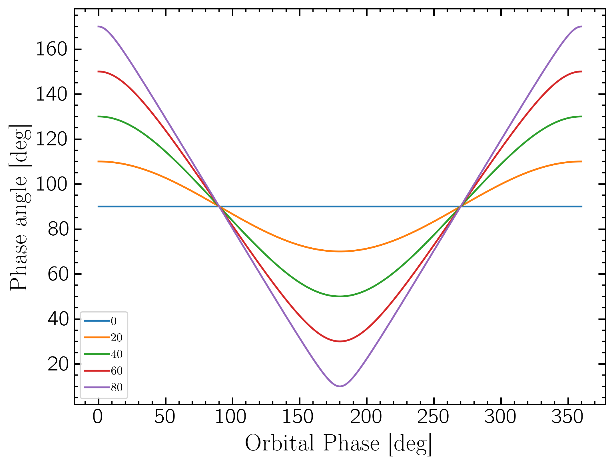
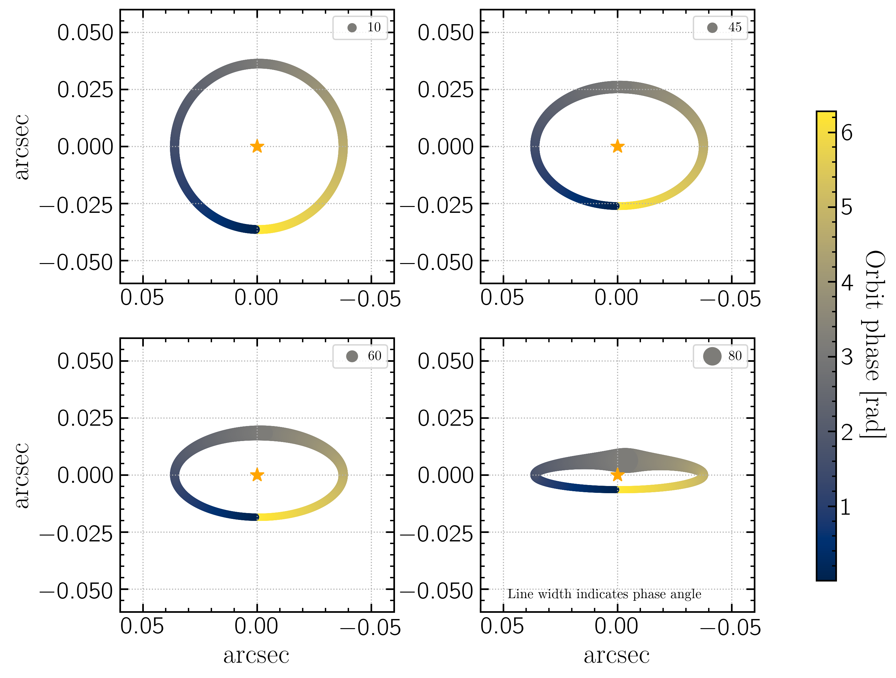

Modeling Proxima Centauri b with ReflectX and Picaso/Virga
==========================================================

Can we distinguish Proxima Centauri b atmosphere cases with ELTs like GMT/GMagAO-X?

Known Prox Cen/ Prox Cen b parameters:

.. list-table::
   :header-rows: 1
   
   * - Param
     - Value
     - Ref
   * - semi-major axis
     - 0.048 au
     - Faria et al. 2022
   * - period
     - 11.19 d
     - Faria et al. 2022
   * - eccentricity
     - 0.02
     - Faria et al. 2022
   * - Mp*sin(incl)
     - 1.07 Mearth
     - Faria et al. 2022
   * - equil. temp.
     - 230 K
     - Anglada-Escude et al. 2016
   * - Star Teff
     - 3000 K
     - Approx value from several refs
   * - Star radius
     - 0.14 Rsun
     - Faria et al. 2022
   * - Star SpT
     - M5.5V
     - Faria et al. 2022
   * - log(g)
     - 5.2 cm s^-2
     - Faria et al. 2022
   * - metallicity
     - 0.2 x solar
     - Schlaufman and Laughlin 2012
    

Bare Rock Model
---------------

The first case is a planet with no atmosphere at all.  In this case, we will simply observe the star's spectrum reflecting from the surface, with a planet-star contrast determined by the albedo of the planet's surface composition. We simulated the planet's surface as a Lambertian sphere with a uniform geometric albedo over the entire surface. We used Eqn 1 from Cahoy et al. 2010 for the contrast of a given Lambertian sphere with albedo :math:`A_g` , radius :math:`R_p` , separation :math:`\rho` , and phase angle :math:`\alpha` 

.. math::

   C(\alpha) = A_g(\lambda) \left( \frac{R_p}{\rho} \right)^2 \left[ \frac{\sin(\alpha) + (\pi - \alpha)\cos(\alpha)}{\pi}  \right]

Since Prox Cen b is an RV detected planet, the orbital inclination is unconstrained.  The value of orbital inclination will affect the true mass of the planet, and consequently the radius, and also the phase angle as a function of orbit phase.

