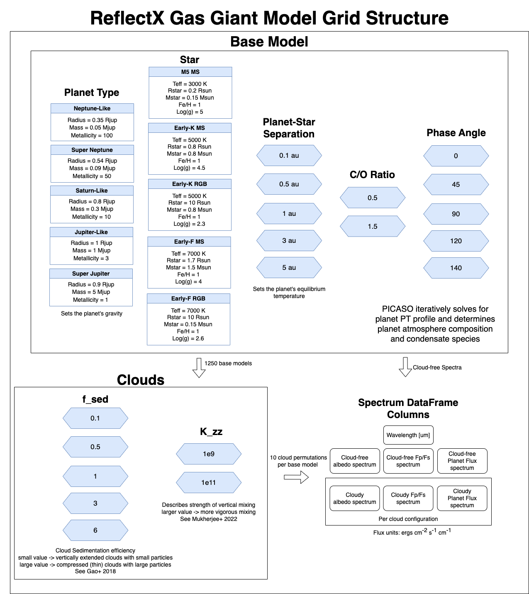

ReflectX Gas Giant Grid
=====

.. note::
  The basics of reflected light with Picaso can be found `here <https://natashabatalha.github.io/picaso/tutorials.html#basics-of-reflected-light>`_

The ReflectX Gas Giant Grid is a grid of reflected light spectra spanning a range of planet and star parameters, illustrated in the above graphic. Unlike the Terrestrial grid, Picaso iteratively solves for the pressure-temperature (PT) profile based on the stellar Teff and planet-star separation. We then use `Virga <https://natashabatalha.github.io/virga/>`_ to decide what molecular species will condense based on the PT profile and to form clouds based on several cloud parameters.

The base Gas Giant grid is defined by permutations of:

 * Five planet types which sets the mass, radius, and metallicity. Mass/radius were estimated from `this plot <https://jaredmales.github.io/mxlib-doc/group__planets.html#ga4b350ecfdeaca1bedb897db770b09789>`_ and metallicity was estimated using `this plot <https://stellarplanet.org/science/mass-metallicity/>`_
      * Neptune-like: R = 0.35 Rjup, M = 0.05 Mjup, Metallicity = 100 x solar
      * Super Neptune: R = 0.54 Rjup, M = 0.09 Mjup, Metallicty = 50 x solar
      * Saturn-like: R = 0.8 Rjup, M = 0.3 Mjup, Metallicity = 10 x solar
      * Jupiter-like: R = 1 Rjup, M = 1 Mjup, Metallicity = 3 x solar
      * SUper Jupiter: R = 0.9 Rjup, M = 5 Mjup, Metallicity = 1 x solar
  * Five stars:

  * Five star-planet separations:
      * 0.1 au
      * 0.5 au
      * 1 au
      * 3 au
      * 5 au

.. note::
  Not all base models will contain all five separations, in cases where the planet was too hot or too cold for the PT profile to converge correctly the models have been omitted

  * Two Carbon to Oxygen ratios, 0.5 and 1.5, which influences molecular mixing ratios (see `Madhusudhan 2021 <https://iopscience.iop.org/article/10.1088/0004-637X/758/1/36>`_)

  * Five phase angles, with 0 deg being full phase, 90 deg being quadrature, and 180 deg being new phase. Above phase ~ 140 deg there is negligible flux reflected towards the observer.  Full phase is not observationally possible but we include it for reference.

This produces 1250 cloud-free base models. There is one directory for each base model which also contains cloudy models based on the following cloud parameter permutations:

  * Five values of f_sed -- 0.1, 0.5, 1, 3, 6 -- which describes the cloud sedimentation efficiency.  A small f_sed produces thick vertically extended clouds with small particles; a large value of f_sed produces thin clouds with large particles. See `Gao et al 2018 <https://ui.adsabs.harvard.edu/abs/2018ApJ...855...86G/abstract>`_

  * Two values of K_zz -- 1x10^9 and 1x10^11 -- which describes the strength of vertical mixing.  Larger value = more vigorous mixing. See `Mukherjee et al. 2022 <https://ui.adsabs.harvard.edu/abs/2022ApJ...938..107M/abstract>`_

Within each base model directory is a spectrum dataframe with these columns:
  * Wavelength 0.4 - 2 microns
  * Stellar flux spectrum from the phoenix model in ergs cm^-2 s^-1 cm^-1
  * Cloud-free albedo spectrum
  * Cloud-free planet - star flux ratio (called ``fpfs``) for all 5 planet radii/mass
  * Cloud-free planet flux spectrum in ergs cm^-2 s^-1 cm^-1 for all 5 planet radii/mass
  * Cloudy albedo spectrum for each of the 10 cloud models
  * Cloudy planet - star flux ratio (called ``fpfs``) for all 5 planet radii/mass for each of the 10 cloud models
  * Cloudy planet flux spectrum in ergs cm^-2 s^-1 cm^-1 for all 5 planet radii/mass for each of the 10 cloud models