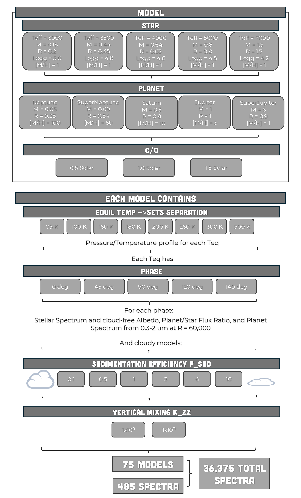

ReflectX Gas Giant Grid
=======================

Structure
^^^^^^^^^

.. note::
  The basics of reflected light with Picaso can be found `here <https://natashabatalha.github.io/picaso/tutorials.html#basics-of-reflected-light>`_

The ReflectX Gas Giant Grid is a grid of reflected light spectra spanning a range of planet and star parameters, illustrated in the below graphic. PICASO iteratively solves for the pressure-temperature (PT) profile based on the stellar Teff and planet equilibrium temperature. We then use `Virga <https://natashabatalha.github.io/virga/>`_ to decide what molecular species will condense based on the PT profile and to form clouds based on several cloud parameters. PT profile csv's and plots with gas condensation curves are provided with each model.

The base Gas Giant grid is defined by permutations of:

* Five main sequence stars, build from Phoenix models:

    * M5-like: Teff = 3000 K, M = 0.16 Msun, R = 0.2 Rsun
    * M2-like: Teff = 3500 K, M = 0.44 Msun, R = 0.45 Rsun
    * K8-like: Teff = 4000 K, M = 0.64 Msun, R = 0.63 Rsun
    * K2-like: Teff = 5000 K, M = 0.8 Msun, R = 0.8 Rsun
    * F1-like: Teff = 7000 K, M = 1.5 Msun, R = 1.7 Rsun

* Five planet types which sets the mass, radius, and metallicity. Mass/radius were estimated from `an emperical planet mass-radius relation <https://jaredmales.github.io/mxlib-doc/group__planets.html#ga4b350ecfdeaca1bedb897db770b09789>`_ and metallicity was estimated using `an emperical mass-metallicity relation <https://stellarplanet.org/science/mass-metallicity/>`_

    * Neptune-like: R = 0.35 Rjup, M = 0.05 Mjup, Metallicity = 100 x solar
    * Super Neptune: R = 0.54 Rjup, M = 0.09 Mjup, Metallicty = 50 x solar
    * Saturn-like: R = 0.8 Rjup, M = 0.3 Mjup, Metallicity = 10 x solar
    * Jupiter-like: R = 1 Rjup, M = 1 Mjup, Metallicity = 3 x solar
    * Super Jupiter: R = 0.9 Rjup, M = 5 Mjup, Metallicity = 1 x solar
    

* Three Carbon to Oxygen ratios, 0.5 and 1.5, which influences molecular mixing ratios (see `Madhusudhan 2021 <https://iopscience.iop.org/article/10.1088/0004-637X/758/1/36>`_)

    * 0.5
    * 1.0
    * 1.5

These three parameters define a base model. There are 75 base models. 

Within each model file, spectra are futher parameterized into:

* Eight planet equilibrium temperatures, which set the planet-star separation: 75 K, 100 K, 150 K, 180 K, 200 K, 250 K, 300 K, 500 K.

* Five phase angles: 0 deg 45 deg, 90 deg, 120 deg, 140 deg. With 0 deg being full phase, 90 deg being quadrature, and 180 deg being new phase. Above phase ~ 140 deg there is negligible flux reflected towards the observer.  Full phase is not observationally possible but we include it for reference.

For each model+Teq there are provided:
    * PT Profile csv file
    * Plot of PT Profile with gas condensation curves

For each model+Teq+phase there are:
    * Cloud-free spectra
    * Cloudy spectra, parameterized by:
      * Six f_sed values, which sets the vertical extent of clouds: 0.1, 0.5, 1, 3, 6, 10. A small f_sed produces thick vertically extended clouds with small particles; a large value of f_sed produces thin clouds with large particles. See `Gao et al 2018 <https://ui.adsabs.harvard.edu/abs/2018ApJ...855...86G/abstract>`_
      * Two  K_zz values, which sets the strength of vertical mixing in the atmosphere: 1x10^9, 1x10^11.  Larger value = more vigorous mixing. See `Mukherjee et al. 2022 <https://ui.adsabs.harvard.edu/abs/2022ApJ...938..107M/abstract>`_

Spectra are stored as Xarrays, which provide details including the units (wavelength: microns, spectra: ergs cm^-2 s^-1 cm^-1) and the values of every parameter (stored as attributes) entered into PICASO to make the model.

Each spectrum contains:

  * Wavelength 0.3 - 2 microns
  * Stellar flux spectrum from the phoenix model in ergs cm^-2 s^-1 cm^-1
  * Albedo spectrum
  * Planet - star flux ratio (called ``fpfs``)
  * Planet flux spectrum in ergs cm^-2 s^-1 cm^-1 

Diagram
^^^^^^^

Using the models
^^^^^^^^^^^^^^^^