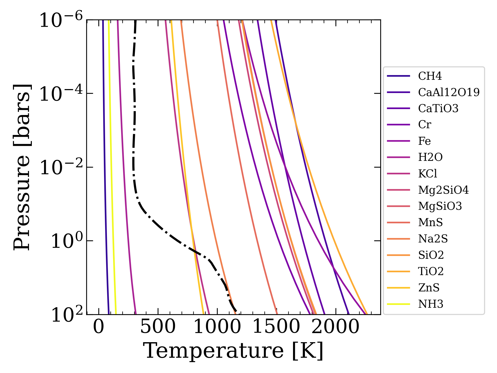

Make a single model
=====

How to run a single ReflectX model via a command line interface.

Setup Picaso and Virga on XWCL computers
-------------------------------------

Install dependencies
^^^^^^^^^^^^^^^^^^^^

Install python via (mini)conda following the instructions `here <https://magao-x.org/docs/handbook/compute/python.html>`_

Create a new python 3.8 environment on whatever computer you're using (I used Kaiju)
::
    conda create -n py38 python=3.8

Make sure you are set up on the `Network Attached Storage <https://magao-x.org/docs/handbook/compute/nas.html>`_ and that you can navigate to and view files in my directories at ``/srv/nas/users/loganpearce/`` (``Volumes/jrmales0/users/loganpearce`` from your local finder)

Activate the environment
::
    conda activate py38

Install Picaso
~~~~~~~~~~~~~~

The Picaso installation instructions are found `here <https://natashabatalha.github.io/picaso/installation.html>`_  
*BUT* don't follow those explicity because there are a number of shortcuts we can take on the lab computers.

First install the ``dev`` branch from GitHub
::
    $ git clone https://github.com/natashabatalha/picaso.git -b dev
    $ cd picaso
    $ pip install .

Now we need to point picaso to the right reference files.  Rather than downloading the numerous and large reference files from the picaso installation instructions, you can just point your picaso version to the ref files I have stored on NAS
Now open your ``.bashrc`` or ``.bash_profile``
::
    $ vi ~/.bashrc

And add these lines
::
    export picaso_refdata="/srv/nas/users/loganpearce/picaso/reference/"
    export PYSYN_CDBS="/srv/nas/users/loganpearce/picaso/reference/grp/redcat/trds"

Source your bash file
::
    $ source ~/.bashrc

And check that the changes are made
::
    $ echo $picaso_refdata
    /srv/nas/users/loganpearce/picaso/reference/
    $ cd $picaso_refdata
    $ ls
    base_cases chemistry config.json evolution opacities version.md

Install Virga
~~~~~~~~~~~~~
Virga is the cloud properties code that Picaso uses for cloudy spectra.

Again the installation instructions can be found `here <https://natashabatalha.github.io/virga/installation.html>`_, but we are going to take some shortcuts.

Again install the ``dev`` branch from GitHub
::
    $ git clone https://github.com/natashabatalha/virga.git -b dev
    $ cd virga
    $ pip install .

Again we can skip downloading the reference files because we can point them on the NAS.

Finally, launch a python session from the XWCL computer terminal and make sure you can import picaso and virga. You can even run through the `basic tutorial <https://natashabatalha.github.io/picaso/notebooks/1_GetStarted.html>`_ to make sure everything is working right.

Running a Model on XWCL computers
-------------------------------------

Copy the script and config file from my NAS directory to your directory on the lab computer.  There are two example config files in that directory, one set up for a gas giant planet and one for a terrestrial planet.  It doesn't matter which one you use.
::
    $ cp /srv/nas/users/loganpearce/MakeReflectXModel.py .
    $ cp /srv/nas/users/loganpearce/config-gasgiant.ini .
    $ cp /srv/nas/users/loganpearce/config-terrestrial.ini .

Or you can download them `here. <https://github.com/logan-pearce/ReflectX/tree/main/ReflectX/MakeSingleReflectXModel>`_ Edit the config file for the model you want to make (see below). Edit the output directory and name of the model (``directory.filename``).  Do not edit any of the reference file paths (``opacity.db``, ``path.to.correlated.k-coefficient.files``, ``meiff.directory``).  If you set it up correctly above then your script should point to the right places for needed reference files.

Once the config file is set up you should be good to go!  Make sure you've activated the python environment and run the script as 
::
    $ python MakeReflectXModel.py config-file.ini

Config file
----------------
ReflectX Command Line Tool takes in a config file that sets up the model parameters. 

Example config files can be found at ``/srv/nas/users/loganpearce/config-gasgiant.ini`` and ``/srv/nas/users/loganpearce/config-terrestrial.ini``.  Both files contain parameters for terrestrial or gas giant models but have each been configured for one of the model types.  If ``model.type`` is set to 'Terrestrial', then gas giant parameters will be ignored, and vice versa.

Sections
~~~~~~~~
| The first three sections are common to both planet types.
| ``MODEL.CONFIG``: Model configurations
| ``modeltype``: Select 'Terrestrial' or 'GasGiant'. For the main grid, I used Terrestrial for anything less than about 10 Mearth.
| ``opacity.db``: Path to the opacity database to use.  Don't change this. 
| ``wavelength.range``: [min,max] of wavelength range for spectra in microns.  The ReflectX grid used [0.4, 2]
| ``output.directory``: Path to where you want to save the model.
| ``directory.filename``: Name the output directory for your model.

| ``STAR.PARAMS``: Parameters for the star in the system
| ``teff``: Effective Temperature
| ``radius``: Star radius
| ``radius.unit``: Unit of above radius. Either `Rsun` or or `km` 
| ``logg``: log gravity
| ``metallicity``: star metallicity in solar units.
| ``star.model.database``: Select which stellar model database to use, either 'phoenix' or 'ck04models'. Phoenix is recommended.

| ``PHASE.PARAMS``: Parameters for phase angle
| ``phase``: angle in degrees.  Angles larger than about 140 deg will return little to no flux.
| ``ntangle``, ``ngangle``: For non-zero phase angles, select the number of vertical and horizonal computational points to use. More points =  longer compute time. Recommend don't change these.

*The effect of increasing phase angle on amount of reflected light. From* `Picaso Docs <https://natashabatalha.github.io/picaso/>`_

Terrestrial models
^^^^^^^^^^^^^^^^^^
.. note::
    You must either set gravity or Mass/Radius. If setting gravity, a radius is also required to generate the planet spectrum. If gravity is set to None, a mass is required.

| ``TERRESTRIAL.PLANET.PARAMS``:
| ``teq``: For the terrestrial models, the equilibrium temp set what clouds will condense, so we use the T_eq to set the clouds and the star-planet separation.
| ``custom.pt.profile.dataframe``: option to input your own PT profile. Not operational yet. 
| ``gravity``: gravity, required if mass = `none`
| ``gravity.unit`` must be `m/(s**2)`
| ``radius``: Planet radius, required for all models
| ``radius.unit``: must be Rearth, Rjup, or km
| ``mass``:Mass (required if gravity = None)
| ``mass.unit`` Must be Mjup or Mearth
| ``surface.albedo``: reflectivity of planet surface. Generally about 0.2. See terrestrial grid page for planet-type specific albedos
| ``custom.atmosphere.config``: Option to input a custom atmosphere database, not currently operational
| ``thermal``: Option to add thermal emission to model. Not currently operational

| ``ATMOSPHERE.GASES.AND.CONCENTRATIONS``: Set which chemical species in the atmosphere and at what concentrations. Conc must add to 1.  Add or subtract any desired species recognized by picaso/virga. Only needed for terrestrial planets.  Follow picaso/virga docs for recognized gas strings.

| ``GREY.CLOUD.SLAB.CONFIG``: Settings for cloud configuration.  See picaso documentation. Only needed for terrestrial planets
| ``ncloud.levels``: Number of cloud levels. The following parameters must be a list of settings for each layer.
| ``g0``: cloud asymmetry factor, between 0-1
| ``w0``: single scattering albedo, between 0-1
| ``opd``: Total optical depth (tau) of each layer
| ``p``: altitude of each layer in log10(pressure), Ex: 2 = 100 bars, -1 = 0.1 bars
| ``dp``: height of each layer in log10(delta P) above given pressure layer. Ex: p = [2], dp = [3] would be a sinlge cloud layer starting at 100 bars and extending up to 0.1 bars. p=[2, -1], dp = [1, 1] would be two cloud layers, one at 100 bars extending up to 10 bars, and a second layer starting at 0.1 bars and extending up to 0.01 bars.

Gas Giant models
^^^^^^^^^^^^^^^^^^
.. note::
    You must either set gravity or Mass/Radius. If setting gravity, a radius is also required to generate the planet spectrum. If gravity is set to None, a mass is required.

| ``GAS.GIANT.PLANET.PARAMS``:
| ``custom.pt.profile.dataframe``: option to input your own PT profile. Not operational yet. 
| ``gravity``: gravity, required if mass = `none`
| ``gravity.unit`` must be `m/(s**2)`
| ``radius``: Planet radius, required for all models
| ``radius.unit``: must be Rearth, Rjup, or km
| ``mass``: Mass (required if gravity = None)
| ``mass.unit`` Must be Mjup or Mearth
| ``tint``: internal temperature
| ``separation``: For the gas giant models, the planet-star separation sets the equilibrium temperature which is used in the climat3e calculation
| ``separation.unit``: must be `au` or `km`
| ``log.metallicity``: planet metalicity. This parameter is used in the correlated-K opacity tables and must be one of: `-1.0, -0.7, -0.5, -0.3, 0, 0.3, 0.5, 0.7, 1.0, 1.3, 1.5, 1.7, 2.0`, Which corresponds to: `0.1, 0.2, 0.3, 0.5, 1, 2, 3, 5, 10, 20, 30, 50, 100` times solar.
| ``ctoo``: C/O ratio
| ``tiovo``: Include TiVO in calculation? Either `yes` or `no`. ReflectX model grid did not use TiOVO.
| ``path.to.correlated.k-coefficient.files``: location of correlated-K opactity files. On Kaiju you can use ``/srv/nas/users/loganpearce/virga/virga/reference/RefIndexFiles``

| ``CLIMATE.CALCULATION.PARAMS``: parameters for climate calculation. The default parameters should be fine in most cases.
| ``bottom.pressure``: log pressure for bottom of calculation. Default = 2
| ``top.pressure``: log pressure for top of calculation. Defaul = -6
| ``nlevel``: Number of plane-parallel layers for radiative transfer calculation.  Default = 91
| ``nstr_upper``: Top most level of initial guessed convection zone. Default = 85
| ``nstr_deep``: Bottom of initial guessed convection zone.  Default = nlevel - 2 = 89
| ``nofczns``: number of initial convective zones. Default = 1
| ``rfacv``: number parameterizing contribution of stellar flux.  Defaul = 0.5

| ``GAS.GIANT.CLOUD.CONFIG``: Settings for cloud configuration.  See picaso documentation.
| ``kzz``: Kzz controls the strength of vertical mixing - high value = more vigorous mixing
| ``fsed``: fsed describes the sedimentation efficiency - higher value = more efficient = thin clouds with large particles, lower value = less efficient = vertically extended puffy clouds with small particles. Typical values 0.1 - 10 
| ``mmw``: atm mean mol weight. Defaul = 2.2
| ``meiff.directory``: Location of virga reference files. On XWCL computers you can use ``/srv/nas/users/loganpearce/virga/virga/reference/RefIndexFiles``

Model Output
------------
``MakeReflectXModel.py`` makes a new directory within the ``output.directory`` that is called ``directory.filename`` from your config file. Within the directory are four files.

#. ``config.ini``: The config file you made is copied into the model directory so that the input parameters are easy to reference.
#. ``model.pkl``: A pickle file of the Picaso model which can be read into future scripts and manipulated as Picaso jdi object.
#. ``PTprofile.png``: A plot of the model's pressure-temperature profile over condensation curves for all the species in Virga. Where the PT profile crosses the condensation curves is where and what type of clouds can condense. For gas giant models, you should use this plot to assess if your model converged correctly (see below).
#. ``ReflectX_spectra.csv``: A csv file of the resulting spectra. The columns are
    #. ``wavelength [um]``: wavelength in microns
    #. ``StarFlux``: stellar flux spectrum in ergs cm$^{-2}$ s$^{-1}$ cm$^{-1}$ 
    #. ``cloud-free-albedo``: albedo spectrum for cloud free model
    #. ``cloud-free-fpfs``: Planet-Star flux ratio (contrast) cloud free spectrum
    #. ``cloud-free-PlanetFlux``: cloud free planet flux spectrum in ergs cm$^{-2}$ s$^{-1}$ cm$^{-1}$ 
    #. ``cloudy-albedo``: albedo spectrum for cloudy model
    #. ``cloudy-fpfs``: Planet-Star flux ratio (contrast) cloudy spectrum
    #. ``cloudy-PlanetFlux``: cloudy planet flux spectrum in ergs cm$^{-2}$ s$^{-1}$ cm$^{-1}$ 

.. note::
    These models take a long time to run, especially the gas giant models.  While Picaso is iteratively solving the PT profile there is a lot of terminal output.  The spectra take a long time and a lot of memory to compute because the opacity databases are very large files.

Evaluating Convergence
-------------------------------------
For the Gas Giant models, Picaso iteratively solves the PT profile for given model setup, so it necessary to check that your resulting PT profile has converged correctly.  ``MakeReflectXModel.py`` saves a plot of your PT profile, along with Virga molcular condensation curves, to help asses the result of your model.

This is an example of a badly converge profile.  At the bottom, between 10^1 and 10^2 bars, there is a sharp bend in the profile and it is not smooth.  For the configuration the bottom of the model atm had been set to 10^2, and it did not converge well down there (a lot of the time 10^2 is fine for the bottom, but sometimes this kink happens).  So I change the bottom of the atm to 10^3, and the resulting PT profile looks smooth and good to go:

Troubleshooting
---------------

* You recieved this error message:

::
    Exception: You have not downloaded the PICASO reference data. You can find it on github here: https://github.com/natashabatalha/picaso/tree/master/reference . If you think you have already downloaded it then you likely just need to set your environment variable. See instructions here: https://natashabatalha.github.io/picaso/installation.html#download-and-link-reference-documentation . You can use `os.environ['PYSYN_CDBS']=<yourpath>` directly in python if you run the line of code before you import PICASO.

You have not pointed your config file to the correct reference files, or you have not added the path to your bash profile. Refer to the top of this page, or for more info go to the Picaso docs `here <https://natashabatalha.github.io/picaso/installation.html>`_ and `here <https://natashabatalha.github.io/picaso/notebooks/FAQs.html#I'm-confused-about-what-opacity-file-to-use>`_
