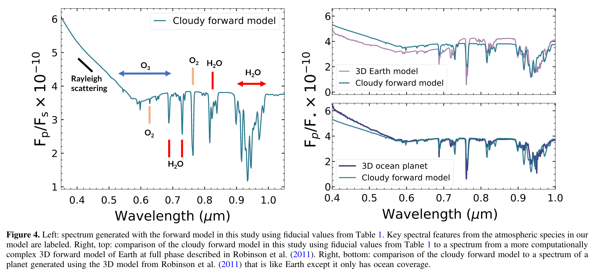
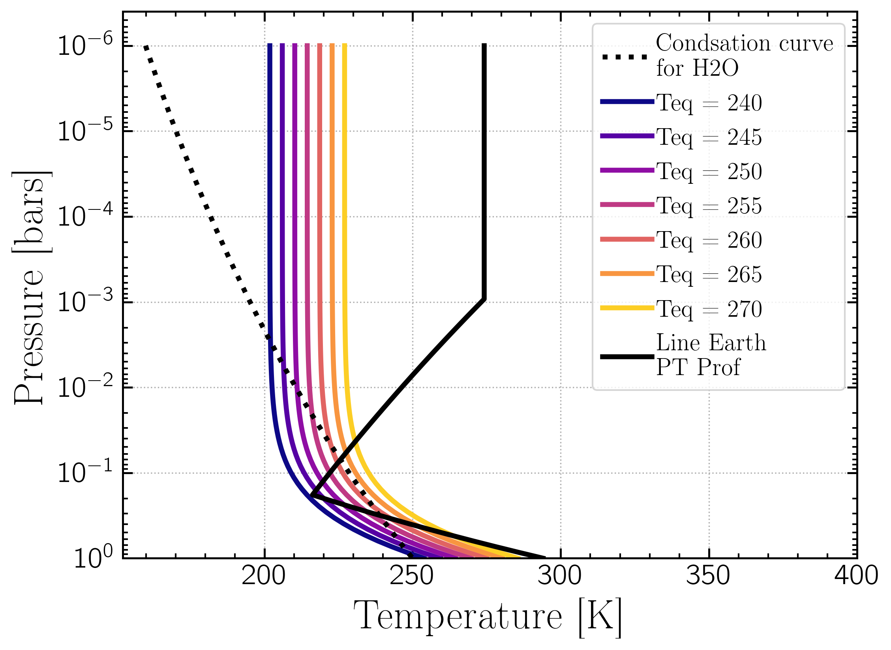
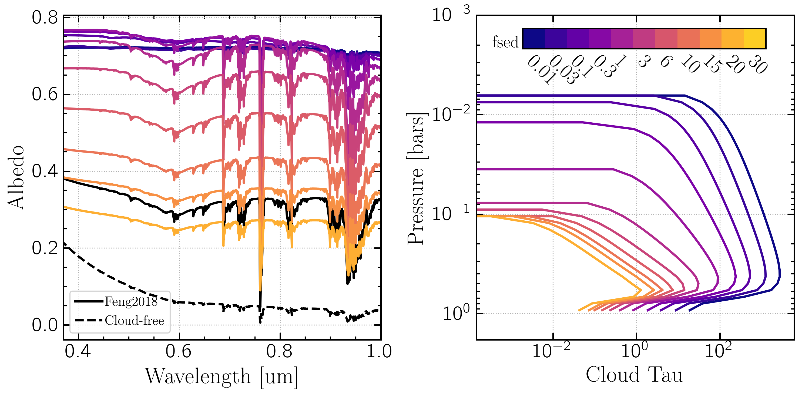
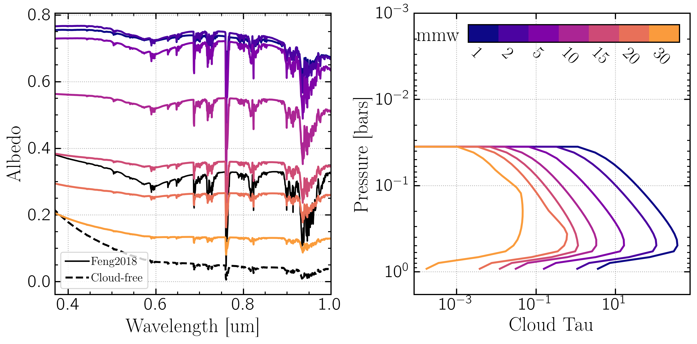
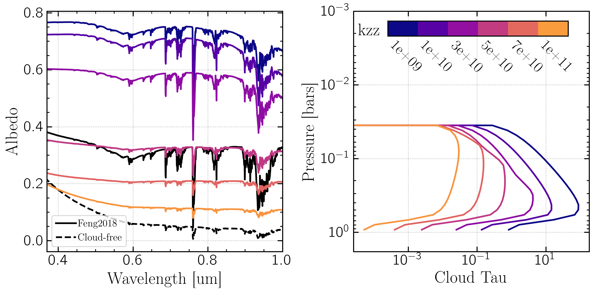
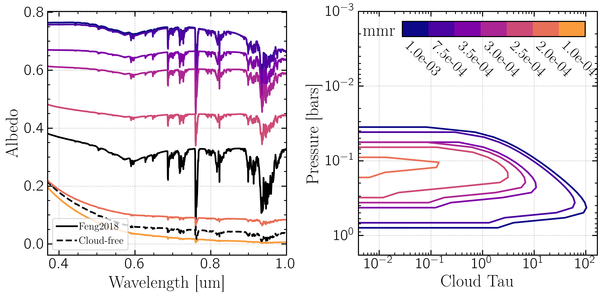
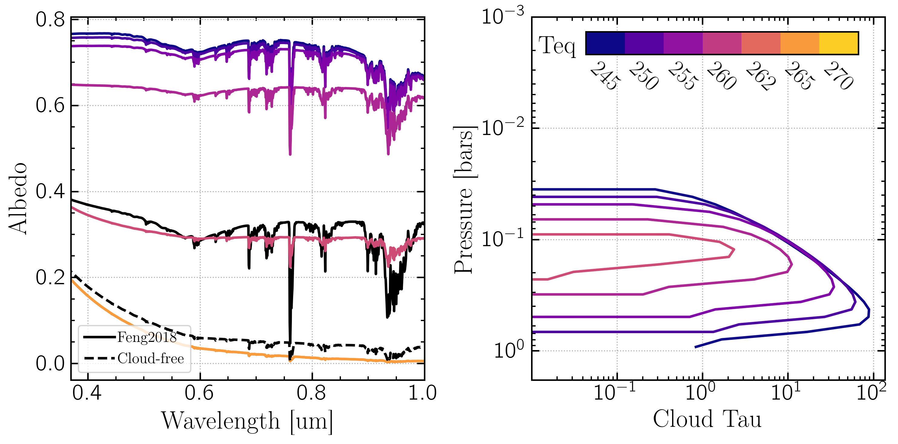
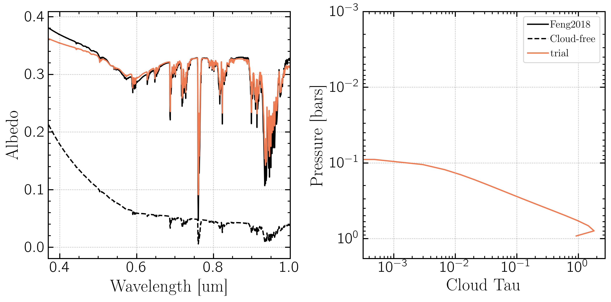

Modeling Earth with ReflectX and Picaso/Virga
==============================================

In `Feng et al. 2018 <https://ui.adsabs.harvard.edu/abs/2018AJ....155..200F/abstract>`_ the authors construct an efficient (minimally parametric) forward model for an Earth-like reflected light spectrum using PICASO for use in retrieval studies.  They construct an Earth-like model using an atmosphere from 1 to 10^{-6} bars consisting of 79\% N2, 21\% O2, and trace amounts of O2, O3, H2O, CO2, and CH4, and a surface albedo of 0.05.  They determined cloud properties by fitting parameters to a 3D model from the Virtual Planet Lab (VPL), and used a cloud model that is a single cloud layer from 0.7 -- 0.6 bars with an optical depth of 10 and water-cloud optical scattering proerties (single scattering albedo (w0) = 0.99, scattering asymetry factor (g0) = 0.85; for a derivation of these parameters see `<https://natashabatalha.github.io/picaso_dev>`_ and `Batalha et al. 2019 <https://ui.adsabs.harvard.edu/abs/2019ApJ...878...70B/abstract>`_).

Below is Figure 4 from that paper showing their model (left) compared to the much more detailed and complicated 3D model of `Robinson et al. 2011 <https://ui.adsabs.harvard.edu/abs/2011AsBio..11..393R/abstract>`_.

`Virga <https://natashabatalha.github.io/virga/>`_ is a package for computing cloud profiles and can be used within PICASO to generate cloud properties and apply them to reflected light spectrum calculations.  Here we used Virga to replicate the model of Feng et al. 2018.  Virga can compute cloud parameters for many species, but for this study we keep to H2O clouds only.

The main parameters to manipulate within Virga are:

  * f_sed, which describes the cloud sedimentation efficiency.  A small f_sed produces thick vertically extended clouds with small particles; a large value of f_sed produces thin clouds with large particles. See `Gao et al 2018 <https://ui.adsabs.harvard.edu/abs/2018ApJ...855...86G/abstract>`_
  * K_zz, which describes the strength of vertical mixing.  Larger value = more vigorous mixing. See `Mukherjee et al. 2022 <https://ui.adsabs.harvard.edu/abs/2022ApJ...938..107M/abstract>`_
  * Atmosphere mean molecular weight (mmw)
  * Condensate mass mixing ratio (gas mmr), which is the ratio of gas vaopr (in this case water) to the mass of dry air.

We did not vary planet metallicty for this study.

The final parameter is the Pressure/Temperature (PT) profile for the model atmosphere.  Feng et al. 2018 used a PT profile fine-tuned to produce Earth-like PT profile (`see here <https://github.com/natashabatalha/picaso/blob/74acc0ee9563d530601127ca39b4882f659b7bd4/picaso/justdoit.py#L2358>`_). In our model, we use a PT profile described in `Batalha et al. 2018 <https://ui.adsabs.harvard.edu/abs/2018ApJ...856L..34B/abstract>`_ Sec 2.2 which parameterizes temperature as a function of pressure using the equilibrium temperature (:math:`T_{eq}`) as the only parameter 
(`Guillot 2010 <https://ui.adsabs.harvard.edu/abs/2010A%26A...520A..27G/abstract>`_, `Line et al. 2013 <https://ui.adsabs.harvard.edu/abs/2013ApJ...778..183L/abstract>`_):

.. math::

   T(z)^{4} = 0.75 \times T_{eq}^{4} (P(z) + 2/3)

where :math:`z` is the height above the surface.

This figure shows the PT profile as a function of :math:`T_{eq}`, with the condensation curve for H2O and the PT profile used in Feng et al 2018.  Clouds can form wherever the PT profile is below the condensation curve.

To explore how each parameter affects the albedo spectrum, we maintained a set of somewhat arbitrary fiducial values for the above parameters and varied each parameter one at a time to observe its affect on the resulting reflected light albedo for a cloudy planet.  The fiducial values are:

  * :math:`f_{sed}` = 1
  * metallicty = 1
  * mmw = 2.2
  * gas mmr = 7.5e-4
  * :math:`k_{zz}` = 1e9
  * :math:`T_{eq}` = 250

The follow plots show the effect of varying a single parameter in Virga on the cloud structre and resulting albedo spectrum compared to a cloud-free atmosphere and to Feng et al. 2018's model.  The left plot shows the albedo spectrum as a function of wavelength; the right plot shows the optical depth (opd; aka tau) of the cloud as a function of the pressure (a proxy for altitude above the surface).  For each plot every other variable is set to the above values and the parameter of interest is varied.

f_sed
~~~~~
Higher f_sed -> thinner clouds with smaller opd, less reflectivity. Low f_sed produces large puffy clouds with high albedos.  Below f_sed ~ 1 the absorption features are diminished and a flatter spectrum results.

mmw
~~~~~
Higher mean molecule weight of the atmosphere -> lower reflectivity, shallower absorption features, and thinner (more transparent) clouds.

K_zz
~~~~~
Higher vertical mixing -> lower reflectivity, shallower absorption features, and thinner (more transparent) clouds.

mmr
~~~~~
Higher condensate mass mixing ratio -> lower reflectivity, shallower absorption features, and thinner clouds both in vertical extent and optical depth.

T_eq
~~~~~
As shown above, T_eq in this model parameterizes the PT profile. Higher T_eq -> less region of the PT profile that falls below the H2O condensation curve -> thinner clouds both in terms of vertical extent and optical depth. Above T_eq = 262K the PT profile no longer crosses the condensation curve and no clouds are formed.

Optimizing by eye
-----------------

We performed a trial and error of the above parameters to find some optimal combinations

Ex 1:

  * :math:`f_{sed}` = 6.5
  * mmw = 2.2
  * gas mmr = 7.5e-4
  * :math:`k_{zz}` = 1e10
  * :math:`T_{eq}` = 237

Ex 2: 
Higher f_sed seems to fit the absorption feature depth and shape well, but that required raising T_eq and mmr to compensate

  * :math:`f_{sed}` = 10
  * mmw = 2.2
  * gas mmr = 1.8e-3
  * :math:`k_{zz}` = 1e10
  * :math:`T_{eq}` = 245

