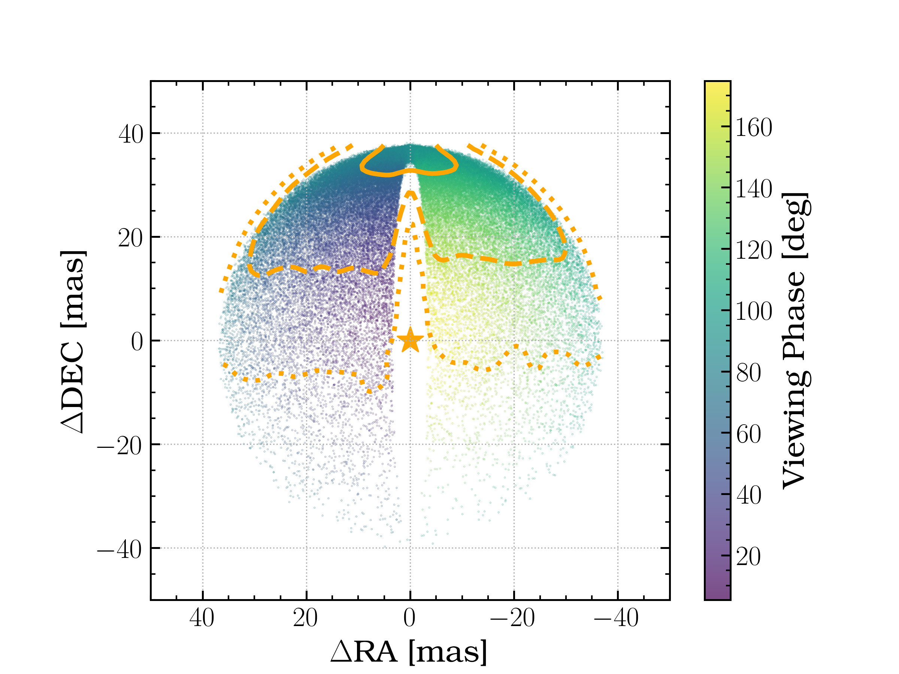
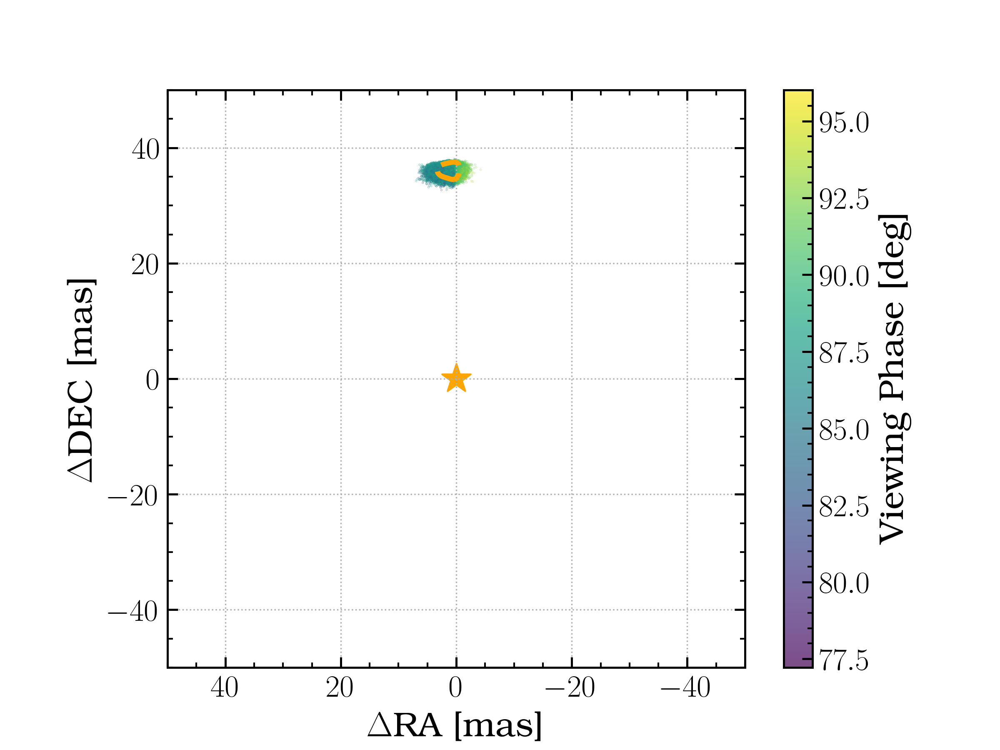
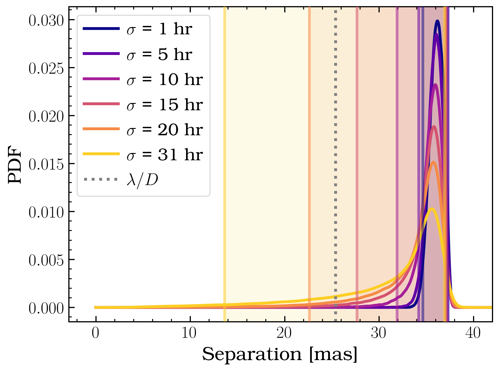

The Problem is Planets Move.
============================

Proxima Centauri b is a (likely) terrestrial planet in its star's habitable zone. As the nearest exoplanet that happens to be of great scientific interest, it is one of the top targets for the first direct detection of an exoplanet in reflected light. Because the host star is an M dwarf, the habitable zone lies closer to the star than hotter stars, where reflected light contrast is higher, and its close proximity to our solar system means the orbit of this close-in planet corresponds to potentially accessible angular separations for direct detection by upcoming ELTs with extreme AO instruments.

There are numerous technical challenges to overcome when trying to directly detect this planet from the ground in the area of AO and wavefront control for speckle suppression at less than 2 resolution elements. Proxima Centauri b (hereafter Prox Cen b) is less than 2 resolution elements separation where residuals are a problem. Additionally the planet-star contrast is higher than has been previously achieved on-sky (:math:`\mathcal{O} 10^{-7}`). The MagAO-X team \citep{Males2024} is currently working to address these challenges and plans to attempt reflected light imaging with MagAO-X in next several years.

One challenge the direct imaging community has yet to encounter in its targets is the problem of orbital motion. Prox Cen b has an orbital period of just under 12 days. With a period that short and the long integration times required for adequate signal-to-noise (10's to 100's of hours), Prox Cen b will move significantly over that time due to orbital motion.

Recent efforts by `Suárez Mascareño et al. <https://ui.adsabs.harvard.edu/abs/2020A&A...639A..77S>`_  and `Faria et al. <https://ui.adsabs.harvard.edu/abs/2022A%26A...658A.115F/abstract>`_ using the ESPRESSO instrument have refined orbital elements for Prox Cen b, as well as the discovery of Prox Cen d with a :math:`\approx 5` day period. Table 1 shows orbital element fit results for Prox Cen b from the ESPRESSO RV data added to past data. Since it is only detected in RV, inclination and longitude of nodes is not constrained. The orbital inclination will have a significant impact on the sky plane separation over the course of an orbit. As inclination approaches edge-on, the sky plane separation at some pooints on the decreases well below what is resolvable by any future instruments; the best chance of observing the planet will be at its maximum elongation from the star. Regardless of inclination, the argument of periastron is measured to be near 0 deg, so the planet will be at maximum elongation near peri- and apastron, making these the optimal times to observe.

Despite recent ESPRESSO data, the epoch of periastron passage is not well constrained, with an uncertainty of :math:`\pm 1.3` days, :math:`\approx` 1/10th of period. This lose constraint presents problems trying to predict the observing time with the best chance of catching the planet at maximum elongation. Figure 1 below (top) shows a cloud of random orbits drawn from the priors given in Table 1 at observing time :math:`t=` mean(:math:`\mathrm{T}_0`) and :math:`\Omega = 0^{\circ}`. The top figure shows this cloud of orbits with :math:`\sigma_{T0} = 1.3` days. The planet phase is shown by the colormap. We see that there are orbits with some probability that are significantly different from periastron, some with crescent phases very close to the star. With this level of uncertainty, we have some probability of having the planet in a position with no hope of detection when we expect it to be at max elongation.  Figure 2 below shows a probability distribution function for planet separation, with 95\% confidence intervals marked by the vertical lines. With an uncertainty of 1.3 d, the highest probability to find the planet is at max elongation, but the 95\% CI extends to very close separations (yellow).  

Figure 1

Figure 2

Decreasing :math:`\sigma_{T0}` is one of the top priorities for planning future reflected light detection observations for Prox Cen b. Figure 1 above (bottom) shows the same cloud of points if :math:`\sigma_{T0}` is decreased to :math:`\pm 1` hour; the blue PDF of Figure \ref{fig:pdfs} shows the same. Now every point is near periastron and quadrature phase, and the 95\% CI spans a much smaller range (35--40 mas); :math:`\sigma_{T0} = 5` hr or even 10 hr provide a significant improvement in precision. While this level of precision may be ambitious, it is representative of the kind of precision needed to tackle this challenging observation.

.. list-table::
   :header-rows: 1
   
   * - Parameter
     - Symbol
     - Unit
     - Prior
     - Reference
   * - Semi-major axis 
     - :math:`a`
     - AU 
     - :math:`\mathcal{N}(0.04856,\,0.00030)`
     - 1
   * - Eccentricity 
     - :math:`e` 
     - N/A 
     - :math:`\mathcal{N}(0.03,\,0.02)` 
     -  1
   * - Period 
     - :math:`P`
     - days 
     - :math:`\mathcal{N}(11.1878,\,0.0032)` 
     - 2
   * - Inclination 
     - :math:`i` 
     - deg 
     - :math:`\cos(i)\; \mathcal{U}[-0.09,\, 0.985]` 
     - N/A
   * - Argument of Periastron 
     - :math:`\omega` 
     - deg 
     - :math:`\mathcal{N}(3.3,\,2.0)$` 
     - 1
   * - Longitude of Nodes 
     - :math:`\Omega` 
     - deg 
     - :math:`\mathcal{U}[0,\,360]` 
     - N/A
   * - Epoch of Periastron Passage 
     - :math:`\mathrm{T}_0`  
     - BJD 
     - :math:`\mathcal{N}(8530.2,\,1.3)` + 2450000  
     - 1
   * - Prox Cen Mass 
     - :math:`\mathrm{M}_{*}` 
     - :math:`\mathrm{M}_{\odot}` 
     - :math:`\mathcal{N}(0.1221,\, 0.0022)` 
     - 1
   * - Prox Cen b Mass :math:`\sin(i)`
     - :math:`\mathrm{M}_{b} \sin(i)` 
     - :math:`\mathrm{M}_{\oplus}`
     - :math:`\mathcal{N}(1.07,\, 0.11)` 
     - 2
   * - Parallax 
     - :math:`\pi` 
     - mas 
     - :math:`\mathcal{N}(768.50,\, 0.20)`
     - 1

Table 1: Prox Cen b System Parameters and Orbital Elements Used in Simulations 
NOTE - Since Prox Cen b is RV detected, :math:`i` and :math:`\Omega` are undetermined. Inclination is drawn from a uniform prior on :math:`\cos(i)` with bounds from :math:`10^{\circ}--88^{\circ}`. Refs: 1) `Suárez Mascareño et al. <https://ui.adsabs.harvard.edu/abs/2020A&A...639A..77S>`_, 2) `Faria et al. <https://ui.adsabs.harvard.edu/abs/2022A%26A...658A.115F/abstract>`_. `Suárez Mascareño et al. <https://ui.adsabs.harvard.edu/abs/2020A&A...639A..77S>`_ elements are taken from their Gaussian Process fit to the full dataset with 2 signals (Table 3).

Similarly, the gas giant planets GJ 876 b and c are relatively close and predicted to be some of the brightest known reflected light planets, making them the ideal first targets for reflected light detection. While both have longer periods than Prox Cen b (:math:`\approx` 61 and 30 days respectively), they similarly need improved orbital element precision to enable direct detection. GJ 876 b and c are believed to be coplanar with :math:`i=59^{\circ}` which removes planet mass and inclination unknowns (although this constraint was imposed for stability arguments). GJ 876 b :math:`\mathrm{T}_0`  measurements are over a decade old, while more recent RV fits \citep{rosenthal2021} determined the conjunction time rather than periastron time; nevertheless the \citet{rivera2010} estimate of:math:`\mathrm{T}_0` , while using a reference date in 1997, produced a relatively precise :math:`\mathrm{T}_0` estimate (:math:`\approx` 13 hours, 1\% of the period) even when propagated forward to 2026, so :math:`\mathrm{T}_0`  is less of a concern if this measurement is accurate. However, the argument of periastron (:math:`\omega`) estimate varies widely among literature, which affects the point in the orbit the planet will be at maximum elongation. So in addition to uncertainties in time, the location of periastron is also uncertain, making the timing of max elongation difficult to predict. Figure \ref{fig:gj876borbits} shows orbits from the mean values of parameters of four literature orbit solutions, given in Table \ref{tab:gj876borb}. All four orbits have similar locations of max elongation, but the phase of the orbit at which that occurs varies widely.  GJ 876 c has similar varying orbit solutions.