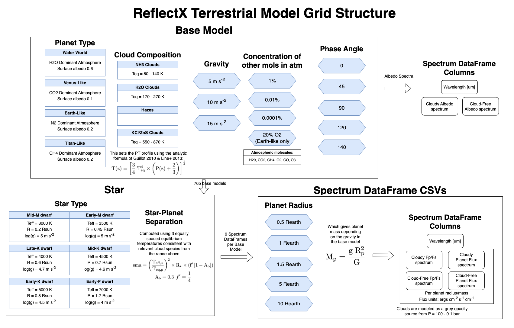

ReflectX Terrestrial Grid
=====

.. note::
  The basics of reflected light with Picaso can be found `here <https://natashabatalha.github.io/picaso/tutorials.html#basics-of-reflected-light>`_

The ReflectX Terrestrial Grid is a grid of reflected light spectra spanning a range of planet and star parameters, illustrated in the above graphic. The Terrestrial grid is set up differently from the Gas Giant grid. For Terrestrial models we set an analytical PT profile that depends on equlibrium temperature, decide which cloud species we want to model (which sets a range for allowed Teq), and set the gravity. We do not use the iterative PT profile solving of the Gas Giant grid.

The base grid is defined by permutations of:
  
  * Four planet types which sets what the dominant molecule in the atmosphere is and the surface albedo:
      * Water world: H2O dominant atmosphere, surface albedo = 0.6, same as Earth's open oceans
      * Venus-like world: CO2 dominant atm, surface albedo = `0.1 <https://iopscience.iop.org/article/10.3847/1538-4357/ab9cba>`_
      * Earth-like world: N2 dominant atm, surface albedo = 0.2
      * Titan-like world: CH4 dominant atm, surface albedo = `0.2 <https://www.sciencedirect.com/science/article/pii/S003206330600136X>`_
  * Four cloud compositions which is set by the equilibrium temperature, which sets the pressure-temperature (PT) profile (`Guillot 2010 <https://ui.adsabs.harvard.edu/abs/2010A%26A...520A..27G/abstract>`_, `Line et al. 2013 <https://ui.adsabs.harvard.edu/abs/2013ApJ...778..183L/abstract>`_), and determines which molecules condense into clouds. 
      * Teq = 80 - 140 K: NH3 clouds
      * Teq = 170 - 270 K: H2O clouds
      * TBD: Hazes
      * Teq = 550 - 870 K: Hot KCl and ZnS clouds

This figure shows some PT Profiles within the above ranges overplotted with the condensation curves for the relevant molecules. Pressure on the y-axis is a proxy for altitude above the surface. Where the PT profile crosses the condensation curve clouds are able to form.

    .. image:: images/Terrestrial-PTprof-CondCurves.png
      :width: 500
      :align: center

  * There are three gravities, which captures internal composition and informs the mass/radius relationship.
  * Four concentrations for other molecules in the atmosphere: H2O, CO2, CH4, O2, CO, O3. For each planet type, every other molecule is set to the selected concentration and the dominant molecule concentration is set to 1 - sum(num_other_molecules * concentration)
  * Five phase angles, with 0 deg being full phase, 90 deg being quadrature, and 180 deg being new phase. Above phase ~ 140 deg there is negligible flux reflected towards the observer.  Full phase is not observationally possible but we include it for reference.

This produces 765 base models, which define the cloudy and cloud-free albedo spectra. There is one directory for each base model wich contains the following permutations.

  * There are 6 star types:
      * Mid M dwarf: Teff = 3000 K, R = 0.2 Rsun, log(g) = 5 m/s
      * Early M dwarf: Teff = 3500 K, R = 0.45 Rsun, log(g) = 5 m/s
      * Late K dwarf: Teff = 4000 K, R = 0.6 Rsun, log(g) = 4.7 m/s
      * Mid K dwarf: Teff = 4500 K, R = 0.7 Rsun, log(g) = 4.6 m/s 
      * Early K dwarf: Teff = 5000 K, R = 0.8 Rsun, log(g) = 4.5 m/s 
      * Early F dwarf: Teff = 7000 K, R = 1.7 Rsun, log(g) = 4 m/s 
  * The star Teff and the planet's Teq will set the star-planet separation, and the cloud species will set the allowed ranges of Teq for the planet.  So for each star, we select 3 Teq's within the range given above for the selected cloud species, and compute the star-planet separation for each Teq.

This produces nine spectrum dataframe files per base model, stored in the base model directory. Within each spectrum dataframe there are five different planet radii permutations, from which with planet's mass is computed for the chosen gravity:
  * 0.5 Rearth
  * 1 Rearth
  * 1.5 Rearth
  * 5 Rearth
  * 10 Rearth

Each of the nine spectrum dataframe files contains columns:
  * Wavelength 0.4 - 2 microns
  * Cloud-free albedo spectrum
  * Cloudy albedo spectrum
  * Stellar flux spectrum from the phoenix model in ergs cm^-2 s^-1 cm^-1
  * Cloud-free planet - star flux ratio (called ``fpfs``) for all 5 planet radii/mass
  * Cloud-free planet flux spectrum in ergs cm^-2 s^-1 cm^-1 for all 5 planet radii/mass
  * Cloudy planet - star flux ratio (called ``fpfs``) for all 5 planet radii/mass
  * Cloudy planet flux spectrum in ergs cm^-2 s^-1 cm^-1 for all 5 planet radii/mass